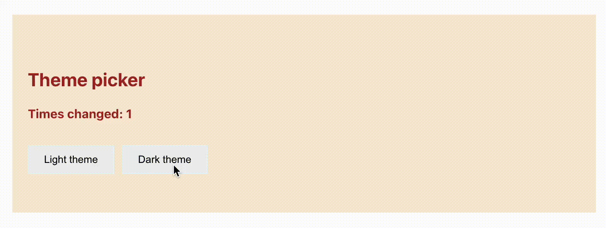

# Using React's state hook 🪝

This app was created with <code>create-react-app</code>, so, the only thing left to do before you start coding is:

```bash
npm install
npm start
```

## Goals 🎯

You are given a <code>Switch.js</code> component that, for now, is dummy.

The goal of this exercise is to turn it into a component that will change the theme from dark to light with the click of a button, and will also keep track of how many times the theme was changed:



You are already given the basic code and some CSS classes to help you with the theme change.

---

## Iteration 1: The counter

On the <code>Switch.js</code> component:

- Use the [hook "useState"](https://reactjs.org/docs/hooks-state.html) to create a state called count. Its initial value should be 0. ⚠️ Remember to import the hook at the top of the component so that you can use it:

```js
import { useState } from 'react'
```

- Print the value inside of the H4 that you have, next to "times changed". Right now it should print: "Times changed: 0"
- Create two buttons, *Light theme* and *Dark theme*
- Create two functions: *setDarkTheme* and *setLightTheme*. For now, both functions will do the same: they should increase the counter state by 1.
- Each button, **when clicked**, should call its own function

---
## Iteration 2: The theme picker

If you take a closer look at what the <code>Switch.js</code> component returns, you will see that it has two classes:

```html
<div className='switch light'>
```

One of them is is the *switch* class. That gives is it the padding, etc. That one shouldn't change.

The other one is the *light* class, which right now is hardcoded and sets the theme to *light*. We want to change that class to *dark* with the click of a button, so: **we want to turn that into a dynamic and chanding class**. How so?

With ✨ useState ✨ again.

>📝 Note: the CSS has already been written! You just need to change the classes!

You already have the buttons and the functions to change the theme of the Switch.

- Create a new state called theme. It's initial state should be "light".
- Inside the className attribute, change the "light" hardcoded class name for the value of the *theme* state. 

💡 *Hint: if you use { } to write the className, you can use the string interpolator... it's plain JavaScript...😉*

<details>
<summary>If you get really stuck with this part, click here to check the solution</summary>

```js
    <div className={`switch ${theme}`}>
```
</details>


- Then, each one of the functions, setDarkTheme and setLightTheme should change the theme state to "dark" or "light"

Happy console.logging ⚛️


